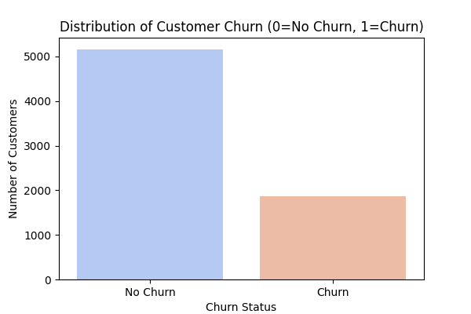
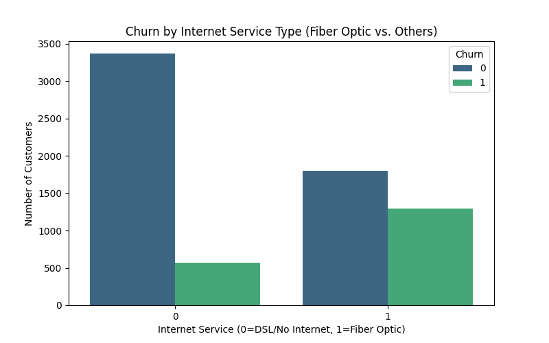
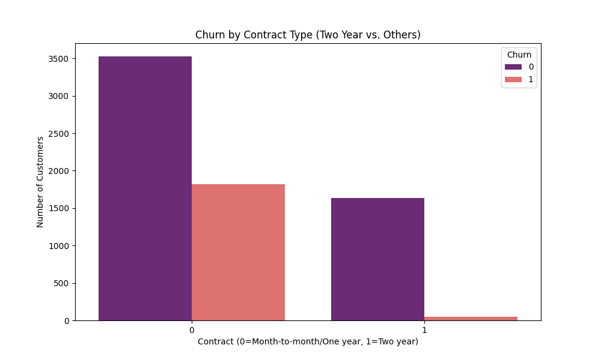
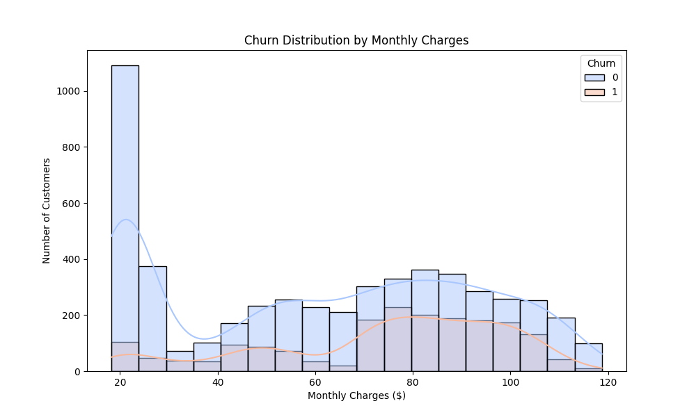
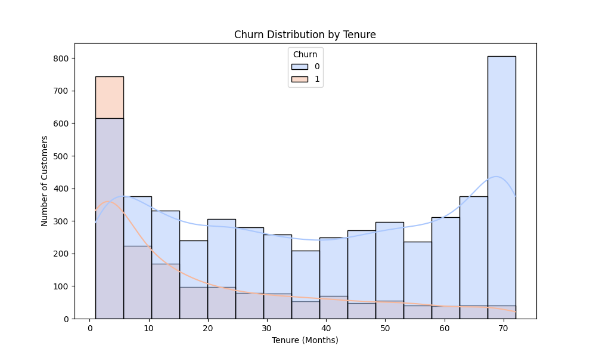
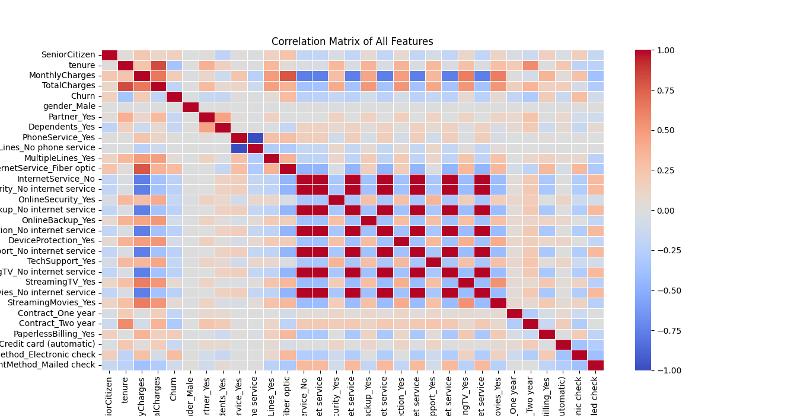

Key Visualizations:**

### Churn Distribution

### Churn by Internet Service Type

### Churn by Contract Type

### Churn Distribution by Monthly Charges

### Churn Distribution by Tenure

### Correlation Matrix of All Features

